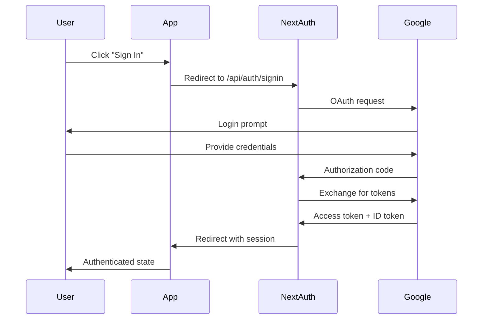

# API Documentation

## 📡 Uthao API Reference

This document provides comprehensive information about the Uthao application's API endpoints, authentication, and integration capabilities.

## 🔐 Authentication

### NextAuth.js Integration

Uthao uses NextAuth.js for secure authentication with Google OAuth 2.0.

#### Authentication Endpoints

| Method | Endpoint | Description |
|--------|----------|-------------|
| `GET` | `/api/auth/signin` | Initiate sign-in process |
| `GET` | `/api/auth/signout` | Sign out current user |
| `GET` | `/api/auth/session` | Get current session |
| `GET` | `/api/auth/providers` | Get available providers |
| `POST` | `/api/auth/signin/google` | Google OAuth sign-in |

#### Authentication Flow



### Session Management

#### Getting Current Session

```typescript
import { useSession } from 'next-auth/react'

function Component() {
  const { data: session, status } = useSession()
  
  if (status === 'loading') return <p>Loading...</p>
  if (status === 'unauthenticated') return <p>Not signed in</p>
  
  return <p>Signed in as {session?.user?.email}</p>
}
```

#### Server-Side Session

```typescript
import { getServerSession } from 'next-auth/next'
import { authOptions } from '@/app/api/auth/[...nextauth]/route'

export async function getServerSideProps(context) {
  const session = await getServerSession(context.req, context.res, authOptions)
  
  if (!session) {
    return {
      redirect: {
        destination: '/login',
        permanent: false,
      },
    }
  }
  
  return {
    props: { session },
  }
}
```

## 🛠️ Internal APIs

### Local Storage API

The application uses localStorage for client-side data persistence.

#### User Management

```typescript
// Save user data
import { saveUser, getUser, loginUser, logoutUser } from '@/lib/auth'

// Save or update user
const user = {
  id: '1',
  name: 'John Doe',
  email: 'john@example.com',
  password: 'hashedPassword'
}
saveUser(user)

// Get current user
const currentUser = getUser()

// Login user
const authenticatedUser = loginUser('john@example.com', 'password')

// Logout user
logoutUser()
```

#### Data Types

```typescript
interface User {
  id: string
  name: string
  email: string
  password: string
  createdAt?: Date
  updatedAt?: Date
}

interface Session {
  user: User
  expires: string
}
```

## 🌐 External Integrations

### Google OAuth 2.0

#### Configuration

```typescript
// app/api/auth/[...nextauth]/route.ts
import GoogleProvider from 'next-auth/providers/google'

const handler = NextAuth({
  providers: [
    GoogleProvider({
      clientId: process.env.GOOGLE_CLIENT_ID!,
      clientSecret: process.env.GOOGLE_CLIENT_SECRET!,
    })
  ],
  pages: {
    signIn: '/login',
  },
})
```

#### Environment Variables

```env
GOOGLE_CLIENT_ID=your_google_client_id
GOOGLE_CLIENT_SECRET=your_google_client_secret
NEXTAUTH_URL=http://localhost:3000
NEXTAUTH_SECRET=your_nextauth_secret
```

### SEO & Metadata APIs

#### Sitemap Generation

```typescript
// app/sitemap.ts
import { MetadataRoute } from 'next'

export default function sitemap(): MetadataRoute.Sitemap {
  return [
    {
      url: 'https://uthao-cwtk.vercel.app/',
      lastModified: new Date(),
      changeFrequency: 'weekly',
      priority: 1,
    },
    // Additional URLs...
  ]
}
```

#### Robots.txt

```typescript
// app/robots.ts
import { MetadataRoute } from 'next'

export default function robots(): MetadataRoute.Robots {
  return {
    rules: {
      userAgent: '*',
      allow: '/',
      disallow: ['/api/', '/admin/', '/_next/'],
    },
    sitemap: 'https://uthao.com/sitemap.xml',
  }
}
```

## 📊 Data Models

### Application Constants

```typescript
// src/constants/index.ts
export const APP_CONFIG = {
  name: "Uthao",
  description: "Navigate global trade with trusted ocean logistics...",
  version: "1.0.0",
  url: "https://uthao-cwtk.vercel.app/",
  keywords: "ocean logistics, global shipping...",
  author: "Mohammed Samier Mouawad",
  type: "website",
  locale: "en_US",
} as const

export const ROUTES = {
  HOME: "/",
  Services: "/page/services",
  Process: "/page/Steps",
  Stories: "/page/Stories",
  Career: "/page/career",
  LOGIN: "/login",
} as const
```

### Component Types

```typescript
// Authentication Types
interface AuthProps {
  session?: Session | null
  status: 'loading' | 'authenticated' | 'unauthenticated'
}

// Navigation Types
interface NavigationItem {
  label: string
  href: string
  icon?: React.ComponentType
}

// Form Types
interface ShippingFormData {
  origin: string
  destination: string
  cargoType: string
  weight: number
  dimensions: {
    length: number
    width: number
    height: number
  }
}

// Partner Types
interface Partner {
  id: string
  name: string
  logo: string
  website?: string
}
```

## 🔧 Utility Functions

### Shipping Calculator

```typescript
// src/utils/shippingUtils.ts
export interface ShippingCalculation {
  baseRate: number
  distance: number
  weight: number
  totalCost: number
  estimatedDays: number
}

export function calculateShipping(
  origin: string,
  destination: string,
  weight: number
): ShippingCalculation {
  // Implementation details...
}
```

### Authentication Helpers

```typescript
// src/lib/auth/index.ts
export const getInitials = (name: string): string => {
  return name
    .split(" ")
    .map((n) => n[0])
    .join("")
    .toUpperCase()
    .slice(0, 2)
}

export const validateEmail = (email: string): boolean => {
  const emailRegex = /^[^\s@]+@[^\s@]+\.[^\s@]+$/
  return emailRegex.test(email)
}
```

## 🎨 Component APIs

### Custom Hooks

#### useAuth Hook

```typescript
// src/hooks/useAuth/useAuth.ts
import { useSession } from 'next-auth/react'

export function useAuth() {
  const { data: session, status } = useSession()
  
  return {
    user: session?.user,
    isLoading: status === 'loading',
    isAuthenticated: status === 'authenticated',
    isUnauthenticated: status === 'unauthenticated',
  }
}
```

#### useResponsive Hook

```typescript
// src/hooks/useResponsive/useResponsive.ts
import { useState, useEffect } from 'react'

export function useResponsive() {
  const [isMobile, setIsMobile] = useState(false)
  
  useEffect(() => {
    const checkDevice = () => {
      setIsMobile(window.innerWidth < 768)
    }
    
    checkDevice()
    window.addEventListener('resize', checkDevice)
    
    return () => window.removeEventListener('resize', checkDevice)
  }, [])
  
  return { isMobile }
}
```

### Form Components

#### SearchForm API

```typescript
interface SearchFormProps {
  onSubmit: (data: SearchFormData) => void
  loading?: boolean
  initialValues?: Partial<SearchFormData>
}

interface SearchFormData {
  origin: string
  destination: string
  departureDate: Date
  cargoType: string
}
```

## 🚀 Performance APIs

### Image Optimization

```typescript
// Next.js Image component usage
import Image from 'next/image'

<Image
  src="/hero-image.webp"
  alt="Ocean logistics"
  width={1200}
  height={600}
  priority
  placeholder="blur"
  blurDataURL="data:image/jpeg;base64,..."
/>
```

### Font Optimization

```typescript
// app/layout.tsx
import { Geist, Geist_Mono, Playfair_Display } from 'next/font/google'

const geistSans = Geist({
  variable: '--font-geist-sans',
  subsets: ['latin'],
})

const playfairDisplay = Playfair_Display({
  variable: '--font-playfair',
  subsets: ['latin'],
})
```

## 📱 PWA APIs

### Manifest Configuration

```json
// public/manifest.json
{
  "name": "Uthao - Ocean Logistics",
  "short_name": "Uthao",
  "description": "Global ocean logistics and shipping solutions",
  "start_url": "/",
  "display": "standalone",
  "background_color": "#ffffff",
  "theme_color": "#1e40af",
  "icons": [
    {
      "src": "/android-chrome-192x192.png",
      "sizes": "192x192",
      "type": "image/png"
    }
  ]
}
```

## 🔍 Analytics & Monitoring

### Performance Monitoring

```typescript
// Performance metrics collection
export function reportWebVitals(metric: any) {
  switch (metric.name) {
    case 'CLS':
    case 'FID':
    case 'FCP':
    case 'LCP':
    case 'TTFB':
      // Send to analytics service
      console.log(metric)
      break
    default:
      break
  }
}
```

## 🛡️ Security APIs

### CSRF Protection

```typescript
// Automatic CSRF protection with NextAuth.js
// No additional configuration required
```

### Content Security Policy

```typescript
// next.config.ts
const nextConfig = {
  async headers() {
    return [
      {
        source: '/(.*)',
        headers: [
          {
            key: 'X-Content-Type-Options',
            value: 'nosniff',
          },
          {
            key: 'X-Frame-Options',
            value: 'DENY',
          },
          {
            key: 'X-XSS-Protection',
            value: '1; mode=block',
          },
        ],
      },
    ]
  },
}
```

## 📚 Error Handling

### API Error Responses

```typescript
interface APIError {
  error: string
  message: string
  statusCode: number
  timestamp: string
}

// Example error response
{
  "error": "AUTHENTICATION_REQUIRED",
  "message": "User must be authenticated to access this resource",
  "statusCode": 401,
  "timestamp": "2025-01-12T10:30:00Z"
}
```

### Error Boundaries

```typescript
// components/ErrorBoundary.tsx
import { ErrorBoundary } from 'react-error-boundary'

function ErrorFallback({error, resetErrorBoundary}) {
  return (
    <div role="alert">
      <h2>Something went wrong:</h2>
      <pre>{error.message}</pre>
      <button onClick={resetErrorBoundary}>Try again</button>
    </div>
  )
}

export function AppErrorBoundary({ children }) {
  return (
    <ErrorBoundary
      FallbackComponent={ErrorFallback}
      onError={(error, errorInfo) => {
        console.error('Error caught by boundary:', error, errorInfo)
      }}
    >
      {children}
    </ErrorBoundary>
  )
}
```

## 🔄 State Management

### Local State

```typescript
// Using React hooks for local state
import { useState, useEffect } from 'react'

function useLocalStorage<T>(key: string, initialValue: T) {
  const [storedValue, setStoredValue] = useState<T>(() => {
    if (typeof window === 'undefined') return initialValue
    
    try {
      const item = window.localStorage.getItem(key)
      return item ? JSON.parse(item) : initialValue
    } catch (error) {
      console.error(`Error reading localStorage key "${key}":`, error)
      return initialValue
    }
  })

  const setValue = (value: T | ((val: T) => T)) => {
    try {
      const valueToStore = value instanceof Function ? value(storedValue) : value
      setStoredValue(valueToStore)
      
      if (typeof window !== 'undefined') {
        window.localStorage.setItem(key, JSON.stringify(valueToStore))
      }
    } catch (error) {
      console.error(`Error setting localStorage key "${key}":`, error)
    }
  }

  return [storedValue, setValue] as const
}
```

## 📞 Support & Contact

For API-related questions or issues:

- **Email**: mohammedsamiermouawad@gmail.com
- **Documentation**: Check this file and README.md
- **Issues**: Create a GitHub issue for bugs or feature requests

---

**Last Updated**: January 12, 2025
**API Version**: 1.0.0